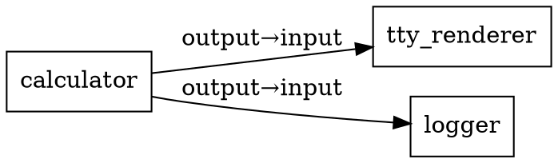

# MK CLI Reference

**Complete command reference for the mk developer orchestrator.**

---

## Overview

The `mk` CLI provides commands for the complete development workflow:

| Command      | Purpose                           | Phase         |
| ------------ | --------------------------------- | ------------- |
| `mk init`    | Initialize new mkolbol project    | Scaffolding   |
| `mk run`     | Execute topology configuration    | Development   |
| `mk doctor`  | Validate configuration and health | Validation    |
| `mk format`  | Convert configs (JSON ↔ YAML)    | Authoring     |
| `mk graph`   | Visualize topology connections    | Documentation |
| `mk dev`     | Hot reload development mode       | Development   |
| `mk logs`    | Query structured logs             | Debugging     |
| `mk trace`   | Analyze flow timing               | Performance   |
| `mk build`   | Compile and bundle artifacts      | Build         |
| `mk package` | Create distributable tarball      | Distribution  |
| `mk ci plan` | Generate CI configuration         | CI/CD         |

**Prerequisites:**

- Node 20+ installed
- mkolbol repository cloned and built (`npm install && npm run build`)
- `MK_LOCAL_NODE=1` environment variable set (for development)

---

## Installation & PATH Setup

### Running mk Without PATH

```bash
# From mkolbol repo root
node dist/scripts/mk.js --help
node dist/scripts/mk.js init hello-calculator
```

### Adding mk to PATH (Recommended)

**Linux/macOS:**

```bash
# Add to ~/.bashrc or ~/.zshrc
export PATH="/path/to/mkolbol/dist/scripts:$PATH"
source ~/.bashrc

# Verify
which mk        # → /path/to/mkolbol/dist/scripts/mk.js
mk --help       # → Shows mk help
```

**Windows:**

```powershell
# Add to PATH via System Properties → Environment Variables
# Or create .cmd shim:
@echo off
node "C:\path\to\mkolbol\dist\scripts\mk.js" %*
```

See **[Installation: mk Anywhere](../../README.md#installation-mk-anywhere-self-install)** for detailed instructions.

---

## Core Commands

### mk init

Initialize a new mkolbol project from a template.

**Usage:**

```
mk init [project-name] [--lang <ts|js>] [--preset <tty|stdio|interactive>] [--force]
```

**Options:**

- `project-name` — Directory name for new project (default: interactive prompt)
- `--lang <ts|js>` — Language for scaffolded files (default: `ts`)
- `--preset <name>` — Template preset to use (default: `tty`)
  - `tty` — TTY rendering with XtermTTYRenderer
  - `stdio` — StdIO pipeline with ConsoleSink
  - `interactive` — Interactive keyboard input
- `--force` — Overwrite existing directory (default: false)

**What it creates:**

```
project-name/
├── .mk/
│   └── options.json       # dev/ci/release profiles
├── src/
│   └── index.ts           # Module implementation
├── mk.json                # Topology configuration
├── package.json           # Dependencies
├── tsconfig.json          # TypeScript config
├── .gitignore             # Git ignore patterns
└── README.md              # Project documentation
```

**Examples:**

```bash
# Interactive mode (wizard prompts for options)
mk init

# Create hello-calculator with TypeScript + TTY preset
mk init hello-calculator --lang ts --preset tty

# Overwrite existing directory
mk init my-project --force

# Create StdIO pipeline project
mk init data-pipeline --lang ts --preset stdio
```

**After init:**

```bash
cd hello-calculator
npm install /path/to/mkolbol-0.2.0.tgz  # Install mkolbol dependency
npm run build
mk run --file mk.json --duration 10
```

**See Also:**

- **[Bootstrap Tutorial](./using-mkolbol-in-your-repo.md)** — Complete out-of-tree workflow
- **[First Five Minutes](./first-five-minutes.md)** — End-to-end mk workflow

---

### mk run

Execute a topology configuration file.

**Usage:**

```
mk run [--file <path>] [--duration <seconds>] [--dry-run] [--profile <name>] [--verbose]
```

**Options:**

- `--file <path>` — Config file (JSON or YAML). Default: `mk.json`
- `--duration <seconds>` — How long to run topology. Default: `5`
- `--dry-run` — Validate config without executing. Default: `false`
- `--profile <name>` — Use profile from `.mk/options.json`. Default: `dev`
- `--verbose` — Show detailed execution logs. Default: `false`

**Examples:**

```bash
# Run default config for 5 seconds
mk run

# Run specific config for 30 seconds
mk run --file config/production.yaml --duration 30

# Validate without executing
mk run --file mk.json --dry-run

# Run with ci profile
mk run --file mk.json --profile ci

# Verbose output
mk run --file mk.json --duration 10 --verbose
```

**Exit Codes:**

- `0` — Success
- `64` — Usage error (invalid flags)
- `65` — Config parse error
- `66` — Config file not found
- `70` — Topology runtime error
- `130` — Interrupted (Ctrl+C)

**Environment:**

- `MK_LOCAL_NODE=1` — Required for development (disables network features)

**See Also:**

- **[Quickstart](./quickstart.md)** — Getting started with mkctl run
- **[Wiring Guide](./wiring-and-tests.md)** — Complete config schema

---

### mk doctor

Validate configuration and perform health checks.

**Usage:**

```
mk doctor [--file <path>] [--module <id>] [--dry-run] [--verbose]
```

**Options:**

- `--file <path>` — Config file to validate. Default: `mk.json`
- `--module <id>` — Check specific module only
- `--dry-run` — Show what would be checked without executing
- `--verbose` — Show detailed diagnostic output

**What it checks:**

- ✓ Config file syntax (JSON/YAML)
- ✓ Schema validation (nodes, connections, params)
- ✓ Module registry (all modules exist)
- ✓ Connection validity (source/target endpoints)
- ✓ Port conflicts (no duplicate listeners)
- ✓ File permissions (log directories, config writes)
- ✓ Circular dependencies (no infinite loops)
- ✓ Resource limits (memory, CPU thresholds)

**Examples:**

```bash
# Full health check
mk doctor --file mk.json

# Check specific module
mk doctor --file mk.json --module calculator

# Dry-run (show checks without executing)
mk doctor --file mk.json --dry-run

# Verbose diagnostics
mk doctor --file mk.json --verbose
```

**Output:**

```
[✓] Config file valid (mk.json)
[✓] All modules registered (3 modules)
[✓] All connections valid (2 connections)
[✓] Port 4000 available
[✓] Log directory writable (logs/)
[✓] No circular dependencies
[✓] Memory limits reasonable (<512MB per node)

✅ Topology healthy — ready to run
```

**Errors:**

```
[✗] Port 4000 already in use
Fix: Run: lsof -i :4000 && kill -9 <pid>
Docs: https://mkolbol.dev/docs/troubleshooting#port-conflicts
Code: PORT_IN_USE
```

**See Also:**

- **[Doctor Guide](./doctor.md)** — Complete troubleshooting reference
- **[Troubleshooting](./troubleshooting.md)** — Common issues and fixes

---

### mk format

Convert configuration files between JSON and YAML.

**Usage:**

```
mk format [--to <json|yaml>] [--from <path>] [--output <path>] [--dry-run]
```

**Options:**

- `--to <format>` — Target format (`json` or `yaml`). Required.
- `--from <path>` — Source config file. Default: `mk.json`
- `--output <path>` — Output file path. Default: inferred from source
- `--dry-run` — Print converted config without writing file

**Examples:**

```bash
# Convert JSON to YAML
mk format --to yaml mk.json
# Creates: mk.yaml

# Convert YAML to JSON
mk format --to json mk.yaml
# Creates: mk.json

# Preview conversion without writing
mk format --to yaml mk.json --dry-run

# Specify output path
mk format --to yaml --from config.json --output topology.yaml
```

**Why YAML?**

- More concise (no quotes on most values)
- Comments supported (`# This is a comment`)
- Multi-line strings easier
- Industry standard for config

**See Also:**

- **[Wiring Guide](./wiring-and-tests.md#config-formats)** — JSON vs YAML comparison

---

### mk graph

Visualize topology connections as ASCII or DOT format.

**Usage:**

```
mk graph [--file <path>] [--format <ascii|dot>] [--output <path>]
```

**Options:**

- `--file <path>` — Config file to visualize. Default: `mk.json`
- `--format <type>` — Output format (`ascii` or `dot`). Default: `ascii`
- `--output <path>` — Write to file instead of stdout

**Examples:**

```bash
# ASCII visualization to console
mk graph --file mk.json

# DOT format for Graphviz
mk graph --file mk.json --format dot

# Save to file
mk graph --file mk.json --format dot --output topology.dot

# Render with Graphviz
mk graph --file mk.json --format dot | dot -Tpng > topology.png
```

**ASCII Output:**

```
┌──────────────┐
│  calculator  │
└──────┬───────┘
       │
       ├────────────────┐
       │                │
       ▼                ▼
┌─────────────┐  ┌──────────┐
│ tty-renderer│  │  logger  │
└─────────────┘  └──────────┘
```

**DOT Output:**



---

### mk dev

Hot reload development mode (watch source files and restart topology on changes).

**Status:** Planned (not yet implemented)

**Usage:**

```
mk dev [--file <path>] [--watch <glob>] [--debounce <ms>]
```

**Options:**

- `--file <path>` — Config file. Default: `mk.json`
- `--watch <glob>` — Files to watch. Default: `src/**/*.{ts,js}`
- `--debounce <ms>` — Restart delay. Default: `300`

**Examples:**

```bash
# Watch and reload on changes
mk dev --file mk.json

# Watch specific files
mk dev --watch "src/**/*.ts,config/**/*.yaml"

# Custom debounce
mk dev --file mk.json --debounce 500
```

**See Also:**

- **[mk dev, logs, trace Guide](./mk-dev-logs-trace.md)** — Development ergonomics

---

### mk logs

Query structured logs with filters.

**Status:** Planned (not yet implemented)

**Usage:**

```
mk logs [--file <path>] [--module <id>] [--level <level>] [--since <time>] [--follow]
```

**Options:**

- `--file <path>` — Log file. Default: `logs/*.jsonl`
- `--module <id>` — Filter by module ID
- `--level <level>` — Filter by level (`error`, `warn`, `info`, `debug`, `trace`)
- `--since <time>` — Show logs since timestamp
- `--follow` — Stream new logs (like `tail -f`)

**Examples:**

```bash
# Show all logs
mk logs

# Filter by module
mk logs --module calculator

# Filter by level
mk logs --level error

# Follow live logs
mk logs --follow

# Combine filters
mk logs --module calculator --level error --follow
```

**See Also:**

- **[mk dev, logs, trace Guide](./mk-dev-logs-trace.md)** — Development ergonomics

---

### mk trace

Analyze flow timing and latency.

**Status:** Planned (not yet implemented)

**Usage:**

```
mk trace [--file <path>] [--duration <seconds>] [--threshold <ms>]
```

**Options:**

- `--file <path>` — Config file. Default: `mk.json`
- `--duration <seconds>` — How long to trace. Default: `10`
- `--threshold <ms>` — Highlight slow operations. Default: `100`

**Examples:**

```bash
# Trace for 10 seconds
mk trace --file mk.json

# Trace for 60 seconds
mk trace --file mk.json --duration 60

# Highlight operations > 50ms
mk trace --file mk.json --threshold 50
```

**Output:**

```
Flow Timing (10s sample):
  calculator → tty-renderer    avg: 2.3ms  p95: 5.1ms  p99: 8.7ms
  calculator → logger           avg: 1.1ms  p95: 2.4ms  p99: 3.9ms

Slow Operations (>100ms):
  [342ms] calculator.start (cold start)
  [156ms] logger.flush (disk sync)
```

**See Also:**

- **[mk dev, logs, trace Guide](./mk-dev-logs-trace.md)** — Development ergonomics

---

### mk build

Compile TypeScript and bundle artifacts.

**Usage:**

```
mk build [--target <dev|production>] [--sourcemaps] [--verbose]
```

**Options:**

- `--target <name>` — Build target (`dev` or `production`). Default: `production`
- `--sourcemaps` — Generate source maps. Default: `false`
- `--verbose` — Show detailed build output

**What it does:**

1. Compiles `src/**/*.ts` → `dist/**/*.js`
2. Bundles dependencies (if configured in `.mk/options.json`)
3. Generates `dist/manifest.json` with provenance:
   - Build timestamp
   - Git commit hash
   - Git branch
   - Module checksums (SHA256)
4. Creates `dist/mk.json` (normalized config)

**Examples:**

```bash
# Production build (minified)
mk build

# Development build (with source maps)
mk build --target dev --sourcemaps

# Verbose output
mk build --verbose
```

**Output:**

```
[mk] Building project...
[mk] Compiling TypeScript → dist/
[mk] Bundling dependencies...
[mk] Generating manifest.json
[mk] Computing checksums...
[mk] ✓ Build complete (2.3s)

Artifacts:
  dist/index.js          12.4 KB
  dist/manifest.json     1.2 KB
  dist/mk.json           3.1 KB
```

**Manifest Example:**

```json
{
  "version": "0.1.0",
  "buildTimestamp": "2025-10-17T04:15:23.456Z",
  "gitCommit": "abc1234",
  "gitBranch": "main",
  "modules": ["CalculatorServer"],
  "checksums": {
    "dist/index.js": "sha256:..."
  }
}
```

**See Also:**

- **[First Five Minutes](./first-five-minutes.md#5-build-artifacts-1-minute)** — Complete workflow

---

### mk package

Create distributable tarball with checksums.

**Usage:**

```
mk package [--output <path>] [--sign] [--with-sourcemaps]
```

**Options:**

- `--output <path>` — Output tarball path. Default: `<project>-<version>.tgz`
- `--sign` — Sign with GPG. Default: `false`
- `--with-sourcemaps` — Include source maps. Default: `false`

**What it includes:**

```
<project>-<version>.tgz
├── dist/                 # Compiled artifacts
├── mk.json              # Topology config
├── .mk/                 # Project options
├── package.json         # Dependencies
├── README.md            # Documentation
└── .mk-checksum.txt     # SHA256 checksums
```

**Examples:**

```bash
# Create tarball
mk package
# → hello-calculator-0.1.0.tgz

# Custom output path
mk package --output releases/v0.1.0.tgz

# Sign with GPG
mk package --sign

# Include source maps
mk package --with-sourcemaps
```

**Install elsewhere:**

```bash
# Copy tarball
scp hello-calculator-0.1.0.tgz remote:/tmp/

# Install and run
cd /tmp
tar -xzf hello-calculator-0.1.0.tgz
cd hello-calculator
npm install
mk run --file mk.json
```

**See Also:**

- **[First Five Minutes](./first-five-minutes.md#6-package-for-distribution-1-minute)** — Complete workflow
- **[Distribution Matrix](./distribution.md)** — Installation methods

---

### mk ci plan

Generate GitHub Actions CI configuration.

**Usage:**

```
mk ci plan [--output] [--with-laminar] [--env]
```

**Options:**

- `--output` — Write to `.github/workflows/test.yml`. Default: print to stdout
- `--with-laminar` — Include Laminar test observability. Default: `false`
- `--env` — Output as environment variables for sourcing

**What it generates:**

- GitHub Actions workflow with matrix testing
- Test matrix from `.mk/options.json` (node versions, test lanes)
- Dependency caching
- Laminar integration (if `--with-laminar`)

**Examples:**

```bash
# Preview CI config
mk ci plan

# Write to .github/workflows/test.yml
mk ci plan --output

# With Laminar test observability
mk ci plan --output --with-laminar

# Export as env vars
eval "$(mk ci plan --env)"
echo $MATRIX_NODE  # → ["20", "24"]
echo $MATRIX_LANE  # → ["threads", "forks"]
```

**Generated Workflow:**

```yaml
name: Tests

on: [push, pull_request]

jobs:
  test:
    runs-on: ubuntu-latest
    strategy:
      matrix:
        node: ['20', '24']
        lane: ['threads', 'forks']
    steps:
      - uses: actions/checkout@v4
      - uses: actions/setup-node@v4
        with:
          node-version: ${{ matrix.node }}
      - run: npm ci
      - run: npm run build
      - run: npm run test:${{ matrix.lane }}
```

**See Also:**

- **[CI Acceptance Smoke](./ci-acceptance-smoke.md)** — Complete CI guide
- **[First Five Minutes](./first-five-minutes.md#7-generate-ci-config-1-minute)** — Complete workflow

---

## Global Flags

These flags work with all commands:

| Flag              | Description                  | Default |
| ----------------- | ---------------------------- | ------- |
| `--help`, `-h`    | Show command help            | -       |
| `--version`, `-v` | Show version                 | -       |
| `--json`          | Machine-readable JSON output | `false` |
| `--no-color`      | Disable ANSI colors          | `false` |
| `--verbose`       | Show detailed output         | `false` |
| `--quiet`         | Suppress non-error output    | `false` |

**Examples:**

```bash
# Show help
mk --help
mk init --help
mk run --help

# JSON output
mk run --file mk.json --json

# No colors (for logs/CI)
mk run --file mk.json --no-color

# Verbose mode
mk doctor --file mk.json --verbose

# Quiet mode
mk build --quiet
```

---

## Environment Variables

| Variable           | Purpose                                                 | Default |
| ------------------ | ------------------------------------------------------- | ------- |
| `MK_LOCAL_NODE`    | Enable local node mode (required for development)       | `0`     |
| `MK_DEBUG`         | Enable debug output                                     | `0`     |
| `MK_DEBUG_MODULES` | Debug specific modules (comma-separated)                | -       |
| `MK_DEBUG_LEVEL`   | Debug level (`error`, `warn`, `info`, `debug`, `trace`) | `info`  |

**Examples:**

```bash
# Enable local node mode
export MK_LOCAL_NODE=1
mk run --file mk.json

# Debug all
DEBUG=1 mk run --file mk.json

# Debug specific modules
MK_DEBUG_MODULES=kernel,pipes mk run --file mk.json

# Debug level
MK_DEBUG_LEVEL=trace mk run --file mk.json
```

**See Also:**

- **[Debug Instrumentation](../../README.md#debug-instrumentation)** — Complete debug guide

---

## Exit Codes

Standard exit codes across all commands:

| Code  | Meaning            | Example                          |
| ----- | ------------------ | -------------------------------- |
| `0`   | Success            | Command completed successfully   |
| `1`   | General error      | Unhandled exception              |
| `64`  | Usage error        | Invalid flags, missing arguments |
| `65`  | Config parse error | Invalid JSON/YAML syntax         |
| `66`  | File not found     | Config file missing              |
| `70`  | Runtime error      | Topology execution failed        |
| `130` | Interrupted        | Ctrl+C (SIGINT)                  |

**Using exit codes in scripts:**

```bash
#!/bin/bash

# Validate config
if mk doctor --file mk.json; then
  echo "Config valid"
else
  echo "Config invalid (exit code: $?)"
  exit 1
fi

# Run topology
mk run --file mk.json --duration 30 || {
  echo "Topology failed (exit code: $?)"
  exit 1
}
```

---

## Error Format

All mk errors follow consistent format:

**Human-readable:**

```
[ERR] ERROR_CODE at <location> — brief description
Fix: <actionable remediation>
Docs: <stable URL>
Code: ERROR_CODE  Rerun: <exact command>
```

**Machine-readable (with `--json`):**

```json
{
  "code": "CONFIG_PARSE",
  "message": "invalid indent under 'nodes'",
  "remediation": "mk format --to json --dry-run",
  "details": { "file": "mk.yaml", "line": 12, "column": 7 },
  "docs": "https://mkolbol.dev/docs/config#yaml-indentation",
  "hint": "use --yaml to author in YAML end-to-end"
}
```

**See Also:**

- **[mk DX Style Guide](./mk-dx-style.md)** — Complete error taxonomy

---

## Did You Mean Pattern

The CLI suggests typo corrections using Levenshtein distance ≤ 2:

**Unknown command:**

```bash
$ mk rnu
[ERR] UNKNOWN_COMMAND — Unknown command "rnu"
Did you mean: run?
Fix: Run: mk --help
```

**Unknown flag:**

```bash
$ mk run --flie mk.json
[ERR] INVALID_ARGUMENT — Unknown flag "--flie"
Did you mean: --file?
Fix: Run: mk run --help
```

**See Also:**

- **[mk DX Style Guide](./mk-dx-style.md#did-you-mean-pattern)** — Implementation details

---

## Quick Reference Card

**Complete workflow:**

```bash
# Initialize project
mk init hello-calculator --lang ts --preset tty
cd hello-calculator

# Install mkolbol dependency
npm install /path/to/mkolbol-0.2.0.tgz

# Build and run
npm run build
mk run --file mk.json --duration 10

# Validate
mk doctor --file mk.json

# Convert to YAML
mk format --to yaml mk.json
mk run --file mk.yaml --duration 10

# Build artifacts
mk build

# Package
mk package
# → hello-calculator-0.1.0.tgz

# Generate CI config
mk ci plan --output
```

---

## Troubleshooting

### mk: command not found

**Cause:** mk not in PATH or not built

**Fix:**

```bash
# Option 1: Use full path
node /path/to/mkolbol/dist/scripts/mk.js --help

# Option 2: Add to PATH
export PATH="/path/to/mkolbol/dist/scripts:$PATH"

# Option 3: Build mkolbol
cd /path/to/mkolbol
npm run build
```

### Config file not found

**Cause:** Wrong path or file doesn't exist

**Fix:**

```bash
# Check current directory
ls -la mk.json

# Use absolute path
mk run --file $(pwd)/mk.json

# Initialize new config
mk init --force
```

### Port already in use

**Cause:** Another process using the port

**Fix:**

```bash
# Find process
lsof -i :4000

# Kill process
kill -9 <pid>

# Or change port in config
# Edit mk.json: "params": { "port": 5000 }
```

### Module not registered

**Cause:** Typo in module name or module not in registry

**Fix:**

```bash
# Check spelling in mk.json
# "module": "CalculatorServer" (exact case)

# Run doctor for detailed errors
mk doctor --file mk.json --verbose
```

---

## See Also

- **[First Five Minutes](./first-five-minutes.md)** — Complete mk workflow tutorial
- **[Bootstrap Tutorial](./using-mkolbol-in-your-repo.md)** — Out-of-tree project setup
- **[Installation Guide](./installation.md)** — mk anywhere PATH setup
- **[Doctor Guide](./doctor.md)** — Complete troubleshooting
- **[Distribution Matrix](./distribution.md)** — Installation methods
- **[mk DX Style Guide](./mk-dx-style.md)** — CLI design principles
