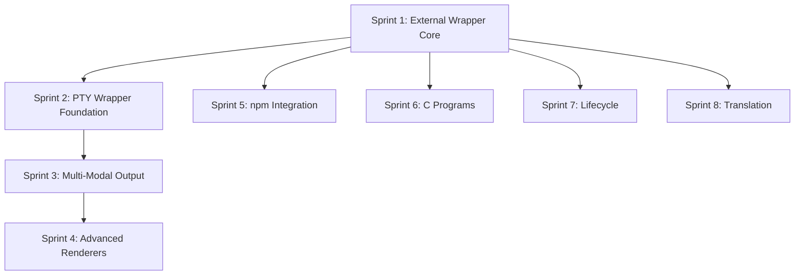

# External Wrapper Implementation Sprints

**Version:** 1.0  
**Status:** Draft  
**Last Updated:** October 11, 2025

## Overview

This document outlines the implementation sprints for the External Server Wrapper system, including PTY wrapper patterns for multi-modal terminal I/O hijacking. The sprints build incrementally from basic wrapper functionality to advanced multi-modal rendering and multi-source input capabilities.

**Total Timeline:** 40-60 days (8-12 weeks)  
**Dependencies:** Core kernel (RFC 02), Executor (RFC 10), Hostess (RFC 08)

## Sprint Overview

| Sprint | Duration  | Focus Area                      | Key Deliverables                                            |
| ------ | --------- | ------------------------------- | ----------------------------------------------------------- |
| 1      | 5-7 days  | External Wrapper Core           | `ExternalServerWrapper` base class, Hostess registration    |
| 2      | 5-7 days  | PTY Wrapper Foundation          | `PTYServerWrapper`, node-pty integration, basic passthrough |
| 3      | 5-7 days  | Multi-Modal Output Foundation   | Passthrough renderer, ANSI parser, split() integration      |
| 4      | 7-10 days | Advanced Renderers              | TTS, MP4, MCP, Screenshot, WebRTC renderers                 |
| 5      | 5-7 days  | npm Package Integration         | npm wrapper patterns, dependency management, examples       |
| 6      | 5-7 days  | C Program/Binary Wrappers       | C program patterns, executable discovery, cross-platform    |
| 7      | 5-7 days  | Process Lifecycle & Supervision | Health monitoring, restart policies, graceful shutdown      |
| 8      | 5-7 days  | Protocol Translation (Optional) | Translation layer framework, standard adapters              |

## Sprint 1: External Wrapper Core

**Duration:** 5-7 days  
**Goal:** Implement basic external server wrapper with Hostess registration

### Prerequisites

- Core kernel implemented (RFC 02)
- Executor server implemented (RFC 10)
- Hostess server implemented (RFC 08)

### Deliverables

#### 1. `ExternalServerWrapper` Base Class

```typescript
// src/wrappers/ExternalServerWrapper.ts
export class ExternalServerWrapper implements Server {
  inputPipe: Pipe;
  outputPipe: Pipe;
  manifest: ServerManifest;
  private process: ChildProcess | null = null;

  constructor(kernel: Kernel, manifest: ServerManifest) {
    this.inputPipe = kernel.createPipe();
    this.outputPipe = kernel.createPipe();
    this.manifest = manifest;
  }

  async spawn(): Promise<void> {
    /* ... */
  }
  async shutdown(): Promise<void> {
    /* ... */
  }
  async restart(): Promise<void> {
    /* ... */
  }
  isRunning(): boolean {
    /* ... */
  }
  getProcessInfo(): ProcessInfo {
    /* ... */
  }
}
```

#### 2. Environment Variable & CLI Argument Handling

- Standard environment variables (MKOLBOL\_\*)
- Template string replacement in arguments
- Environment variable merging with user-provided values

#### 3. Simple stdio Wrapping

- Non-PTY process spawning
- stdin/stdout/stderr pipe connections
- Process exit handling

#### 4. Hostess Registration

- Server manifest format
- Registration on spawn
- Heartbeat mechanism
- Deregistration on shutdown

#### 5. Server Manifest Schema

```typescript
interface ServerManifest {
  name: string;
  fqdn: string;
  class: string;
  owner: string;
  uuid: string;
  command: string;
  args: string[];
  env: Record<string, string>;
  cwd: string;
  ioMode: 'stdio' | 'pty' | 'socket' | 'file';
  terminals: TerminalDefinition[];
  capabilities: ServiceCapabilities;
  restart: 'always' | 'on-failure' | 'never';
  restartDelay: number;
  maxRestarts: number;
}
```

### Unit Tests

```typescript
describe('ExternalServerWrapper', () => {
  it('should spawn external process');
  it('should pass environment variables');
  it('should handle template arguments');
  it('should pipe data through external process');
  it('should register with Hostess on spawn');
  it('should deregister on shutdown');
  it('should report process info');
});
```

### Integration Tests

```typescript
describe('ExternalServerWrapper Integration', () => {
  it('should register with Hostess on spawn');
  it('should appear in Hostess guest book');
  it('should be discoverable by query');
  it('should integrate with Executor');
});
```

### Success Criteria

- ✅ Wrap a simple Node.js script that reads/writes stdio
- ✅ Script registers with Hostess automatically
- ✅ Environment variables passed correctly
- ✅ CLI arguments expanded from templates
- ✅ Process lifecycle managed (spawn, shutdown, restart)
- ✅ All unit tests passing
- ✅ All integration tests passing

### Example Usage

```typescript
const wrapper = new ExternalServerWrapper(kernel, {
  name: 'echo-server',
  command: 'cat',
  args: [],
  ioMode: 'stdio',
  env: { LOG_LEVEL: 'info' },
});

await wrapper.spawn();
wrapper.inputPipe.write('Hello, World!');
// Output appears on wrapper.outputPipe
```

---

## Sprint 2: PTY Wrapper Foundation

**Duration:** 5-7 days  
**Goal:** Implement PTY wrapper for interactive terminal applications

### Prerequisites

- Sprint 1 completed (ExternalServerWrapper)
- node-pty package installed

### Deliverables

#### 1. `PTYServerWrapper` Class

```typescript
// src/wrappers/PTYServerWrapper.ts
export class PTYServerWrapper extends ExternalServerWrapper {
  ptyProcess: IPty;
  terminalSize: { cols: number; rows: number };

  async spawn(): Promise<void> {
    /* ... */
  }
  resize(cols: number, rows: number): void {
    /* ... */
  }
  sendSignal(signal: string): void {
    /* ... */
  }
}
```

#### 2. node-pty Integration

- PTY process spawning
- Terminal type configuration (xterm-256color)
- Initial terminal size
- Character encoding (utf8/binary)

#### 3. Basic ANSI Passthrough (tmux-like)

- Raw ANSI data piping
- No parsing or interpretation
- Direct stdout rendering

#### 4. Terminal Resize Handling

- SIGWINCH signal handling
- Dynamic resize via `ptyProcess.resize()`
- Resize event propagation to renderers

#### 5. PTY Manifest Extensions

```typescript
interface PTYManifest extends ServerManifest {
  ioMode: 'pty';
  terminalType: string;
  initialCols: number;
  initialRows: number;
  enableFlow: boolean;
  encoding: 'utf8' | 'binary';
  shell: string;
  shellArgs: string[];
}
```

### Unit Tests

```typescript
describe('PTYServerWrapper', () => {
  it('should spawn PTY process');
  it('should pipe data bidirectionally');
  it('should handle resize');
  it('should send signals');
  it('should handle process exit');
});
```

### Integration Tests

```typescript
describe('PTYServerWrapper Integration', () => {
  it('should register PTY server with Hostess');
  it('should work with basic shell (bash)');
  it('should handle interactive commands');
});
```

### Success Criteria

- ✅ Wrap bash in PTY
- ✅ Keyboard input → wrapper → shell works
- ✅ Shell output → wrapper → screen works
- ✅ Terminal resize handled correctly
- ✅ Control signals (Ctrl+C, Ctrl+Z) work
- ✅ Interactive prompts work correctly
- ✅ All unit tests passing
- ✅ All integration tests passing

### Example Usage

```typescript
const bashPTY = new PTYServerWrapper(kernel, {
  name: 'bash-session',
  shell: 'bash',
  terminalType: 'xterm-256color',
  initialCols: 80,
  initialRows: 24,
  ioMode: 'pty',
});

await bashPTY.spawn();

// Now you have an interactive bash session
const keyboard = new KeyboardInput(kernel);
const screen = new ScreenRenderer(kernel);

kernel.connect(keyboard.output, bashPTY.input);
kernel.connect(bashPTY.output, screen.input);
```

---

## Sprint 3: Multi-Modal Output Foundation

**Duration:** 5-7 days  
**Goal:** Enable splitting PTY output to multiple renderers

### Prerequisites

- Sprint 2 completed (PTYServerWrapper)
- Kernel's split() primitive implemented

### Deliverables

#### 1. Passthrough Renderer

```typescript
// src/renderers/PassthroughRenderer.ts
export class PassthroughRenderer {
  inputPipe: Pipe;

  constructor(kernel: Kernel) {
    this.inputPipe = kernel.createPipe();
    this.inputPipe.on('data', (data) => {
      process.stdout.write(data);
    });
  }
}
```

#### 2. ANSI Parser Module

```typescript
// src/parsers/ANSIParser.ts
export class ANSIParser {
  parse(data: Buffer): TerminalState;
  private parseEscapeSequence(str: string, start: number): EscapeSequence;
  private handleEscapeSequence(seq: EscapeSequence): void;
}
```

#### 3. Logger Renderer

```typescript
// src/renderers/LoggerRenderer.ts
export class LoggerRenderer {
  inputPipe: Pipe;

  constructor(kernel: Kernel, logFile: string) {
    this.inputPipe = kernel.createPipe();
    this.inputPipe.on('data', (data) => {
      fs.appendFileSync(logFile, data);
    });
  }
}
```

#### 4. Split Integration Examples

- One PTY → multiple renderers
- Example: bash → [passthrough, logger]
- Example: vim → [passthrough, recorder]

#### 5. Terminal State Tracking

```typescript
interface TerminalState {
  cells: Cell[][];
  cursorX: number;
  cursorY: number;
  rows: number;
  cols: number;
  scrollback: Cell[][];
  currentFg: string | null;
  currentBg: string | null;
}
```

### Unit Tests

```typescript
describe('PassthroughRenderer', () => {
  it('should render raw ANSI to stdout');
});

describe('ANSIParser', () => {
  it('should parse regular characters');
  it('should parse ANSI escape sequences');
  it('should handle cursor movement');
  it('should handle color codes');
  it('should handle screen clearing');
});

describe('LoggerRenderer', () => {
  it('should write all data to log file');
});
```

### Integration Tests

```typescript
describe('Multi-Modal Output', () => {
  it('should split PTY output to 2+ renderers');
  it('should render same data to all renderers');
  it('should handle backpressure correctly');
});
```

### Success Criteria

- ✅ One PTY source fans out to multiple renderers using split()
- ✅ Passthrough renderer works correctly
- ✅ Logger renderer captures all output
- ✅ ANSI parser correctly interprets escape sequences
- ✅ Example: bash → [passthrough, logger] working
- ✅ All unit tests passing
- ✅ All integration tests passing

### Example Usage

```typescript
const kernel = new Kernel();

const bashPTY = new PTYServerWrapper(kernel, {
  name: 'bash',
  shell: 'bash',
  ioMode: 'pty',
});

const passthrough = new PassthroughRenderer(kernel);
const logger = new LoggerRenderer(kernel, '/tmp/session.log');

// Split output to both renderers
kernel.split(bashPTY.output, [passthrough.input, logger.input]);

await bashPTY.spawn();
// Now bash output goes to screen AND log file
```

---

## Sprint 4: Advanced Renderers

**Duration:** 7-10 days  
**Goal:** Implement TTS, MP4, MCP, Screenshot, and WebRTC renderers

### Prerequisites

- Sprint 3 completed (Multi-Modal Output Foundation)
- ANSI parser implemented

### Deliverables

#### 1. Text-to-Speech Renderer

```typescript
// src/renderers/TextToSpeechRenderer.ts
export class TextToSpeechRenderer {
  inputPipe: Pipe;
  private parser: ANSIParser;
  private prevState: TerminalState;

  constructor(kernel: Kernel, options: TTSOptions) {
    /* ... */
  }
  private detectChanges(prev: TerminalState, curr: TerminalState) {
    /* ... */
  }
  private speak(text: string): void {
    /* ... */
  }
}
```

**Features:**

- Detect text changes in terminal
- Describe cursor movements
- Read menu changes aloud
- Skip rapid updates (typing)
- Configurable verbosity

#### 2. MP4 Recorder

```typescript
// src/renderers/MP4Recorder.ts
export class MP4Recorder {
  inputPipe: Pipe;
  private canvas: OffscreenCanvas;
  private encoder: VideoEncoder;

  constructor(kernel: Kernel, options: MP4Options) {
    /* ... */
  }
  private renderToCanvas(state: TerminalState): void {
    /* ... */
  }
  private captureFrame(): void {
    /* ... */
  }
  async save(filename: string): Promise<void> {
    /* ... */
  }
}
```

**Features:**

- Render ANSI to off-screen canvas
- Capture frames at configurable FPS (default: 30)
- Encode as H.264/MP4
- Save to file
- Configurable resolution

#### 3. MCP Renderer (LLM-Friendly)

```typescript
// src/renderers/MCPRenderer.ts
export class MCPRenderer {
  inputPipe: Pipe;
  outputPipe: Pipe;
  private parser: ANSIParser;

  constructor(kernel: Kernel) {
    /* ... */
  }
  private formatForLLM(state: TerminalState): any {
    /* ... */
  }
  private extractPlainText(state: TerminalState): string {
    /* ... */
  }
  private detectSections(state: TerminalState): Section[] {
    /* ... */
  }
}
```

**Features:**

- Strip ANSI codes
- Extract plain text
- Detect UI sections (menu, status bar, content)
- Identify cursor location
- Semantic structure detection
- JSON output format

#### 4. Screenshot Renderer

```typescript
// src/renderers/ScreenshotRenderer.ts
export class ScreenshotRenderer {
  inputPipe: Pipe;
  private canvas: OffscreenCanvas;

  constructor(kernel: Kernel, options: ScreenshotOptions) {
    /* ... */
  }
  async captureScreenshot(): Promise<Buffer> {
    /* ... */
  }
  async saveScreenshot(filename: string): Promise<void> {
    /* ... */
  }
}
```

**Features:**

- Capture terminal state as PNG
- Manual or periodic screenshots
- Configurable interval
- Timestamp in filename
- Multiple format support (PNG, JPEG)

#### 5. WebRTC Renderer

```typescript
// src/renderers/WebRTCRenderer.ts
export class WebRTCRenderer {
  inputPipe: Pipe;
  private peerConnection: RTCPeerConnection;
  private canvas: OffscreenCanvas;

  constructor(kernel: Kernel) {
    /* ... */
  }
  private renderToCanvas(state: TerminalState): void {
    /* ... */
  }
  async connect(remoteOffer: RTCSessionDescriptionInit): Promise<RTCSessionDescriptionInit> {
    /* ... */
  }
}
```

**Features:**

- Stream terminal to remote viewers
- Real-time rendering
- Low latency (target: <100ms)
- Multiple viewers support
- STUN/TURN server integration

### Unit Tests

```typescript
describe('TextToSpeechRenderer', () => {
  it('should detect text changes');
  it('should speak new text');
  it('should skip rapid updates');
});

describe('MP4Recorder', () => {
  it('should render terminal to canvas');
  it('should capture frames');
  it('should save as MP4');
});

describe('MCPRenderer', () => {
  it('should strip ANSI codes');
  it('should extract plain text');
  it('should detect UI sections');
});

describe('ScreenshotRenderer', () => {
  it('should capture screenshot');
  it('should save as PNG');
});

describe('WebRTCRenderer', () => {
  it('should establish WebRTC connection');
  it('should stream terminal output');
});
```

### Integration Tests

```typescript
describe('Advanced Renderers Integration', () => {
  it('should use Claude Code with all renderers simultaneously');
  it('should handle backpressure from slow renderers');
  it('should maintain synchronization across renderers');
});
```

### Success Criteria

- ✅ Claude Code wrapper → [passthrough, TTS, MP4, MCP] all working
- ✅ TTS describes UI changes audibly
- ✅ MP4 records full session as video
- ✅ MCP output is LLM-readable (plain text, structured)
- ✅ Screenshots captured correctly
- ✅ WebRTC streams to remote viewer
- ✅ All renderers work simultaneously without conflicts
- ✅ All unit tests passing
- ✅ All integration tests passing

### Example Usage

```typescript
const kernel = new Kernel();

const claudeCode = new PTYServerWrapper(kernel, {
  name: 'claude-code',
  shell: 'claude-code',
  terminalType: 'xterm-256color',
  initialCols: 120,
  initialRows: 40,
  ioMode: 'pty',
});

// All renderers
const passthrough = new PassthroughRenderer(kernel);
const tts = new TextToSpeechRenderer(kernel, { voice: 'en-US' });
const mp4 = new MP4Recorder(kernel, { fps: 30, width: 1200, height: 800 });
const mcp = new MCPRenderer(kernel);
const webrtc = new WebRTCRenderer(kernel);

// Split to all renderers
kernel.split(claudeCode.output, [passthrough.input, tts.input, mp4.input, mcp.input, webrtc.input]);

await claudeCode.spawn();

// Claude Code is now:
// - Displayed on screen
// - Read aloud via TTS
// - Recorded as MP4
// - Available to LLMs via MCP
// - Streamed to remote viewers
```

---

## Sprint 5: npm Package Integration

**Duration:** 5-7 days  
**Goal:** Define patterns for wrapping npm packages as servers

### Prerequisites

- Sprint 1 completed (ExternalServerWrapper)

### Deliverables

#### 1. npm Wrapper Patterns Documentation

- How to wrap npm CLI tools
- How to wrap npm servers
- Package discovery (node_modules/.bin)
- Dependency resolution
- Environment setup

#### 2. npm CLI Tool Example

Wrap an existing npm CLI tool:

```typescript
const cliWrapper = new ExternalServerWrapper(kernel, {
  name: 'prettier-server',
  command: 'node',
  args: ['node_modules/.bin/prettier', '--stdin-filepath', 'file.js'],
  env: {},
  cwd: process.cwd(),
  ioMode: 'stdio',
});
```

#### 3. npm Server Example

Wrap an npm package that provides a server:

```typescript
const sqlServer = new ExternalServerWrapper(kernel, {
  name: 'sqlite-server',
  command: 'node',
  args: ['node_modules/.bin/sqlite-server', '--db', 'data.db'],
  env: {
    MAX_CONNECTIONS: '10',
    LOG_LEVEL: 'info',
  },
  cwd: '/opt/db',
  ioMode: 'stdio',
  terminals: [
    { name: 'query', direction: 'input', protocol: 'sql' },
    { name: 'results', direction: 'output', protocol: 'json' },
  ],
});
```

#### 4. Package.json Integration

- How to declare wrapper as dependency
- How to include in build process
- How to distribute wrapped servers

#### 5. Wrapper Factory Pattern

```typescript
class NPMWrapperFactory {
  static createWrapper(packageName: string, config: NPMWrapperConfig): ExternalServerWrapper {
    const binPath = resolve(`node_modules/.bin/${packageName}`);
    return new ExternalServerWrapper(kernel, {
      name: config.name || packageName,
      command: 'node',
      args: [binPath, ...config.args],
      env: config.env,
      ioMode: config.ioMode || 'stdio',
    });
  }
}
```

### Documentation Deliverables

- `docs/guides/wrapping-npm-packages.md`
- Example: Wrapping prettier
- Example: Wrapping a SQL server npm package
- Example: Wrapping a REST API npm package

### Success Criteria

- ✅ Third-party npm package runs as first-class mkolbol server
- ✅ Wrapper discovers package in node_modules
- ✅ Dependencies resolved correctly
- ✅ Examples for CLI tools, servers, and APIs
- ✅ Documentation complete and clear
- ✅ Wrapper factory pattern working

### Example npm Packages to Wrap

1. **prettier** (CLI tool)
2. **better-sqlite3** (database)
3. **express** (web server)
4. **nodemailer** (email service)
5. **sharp** (image processing)

---

## Sprint 6: C Program/Binary Wrappers

**Duration:** 5-7 days  
**Goal:** Define patterns for wrapping C programs and arbitrary binaries

### Prerequisites

- Sprint 1 completed (ExternalServerWrapper)

### Deliverables

#### 1. C Program Wrapper Patterns Documentation

- Executable discovery (PATH, absolute paths)
- Library dependency handling (LD_LIBRARY_PATH)
- Cross-platform considerations
- Binary permissions

#### 2. Simple C Program Example

Wrap a simple C program:

```typescript
const catWrapper = new ExternalServerWrapper(kernel, {
  name: 'cat-server',
  command: '/bin/cat',
  args: [],
  env: {},
  cwd: '/tmp',
  ioMode: 'stdio',
});
```

#### 3. ImageMagick Example

Wrap ImageMagick for image processing:

```typescript
const imageProcessor = new ExternalServerWrapper(kernel, {
  name: 'image-processor',
  command: '/usr/bin/convert',
  args: [
    '-', // Read from stdin
    '-resize',
    '800x600',
    '-quality',
    '85',
    'png:-', // Write to stdout
  ],
  env: {},
  cwd: '/tmp',
  ioMode: 'stdio',
  terminals: [
    { name: 'input', direction: 'input', protocol: 'image-binary' },
    { name: 'output', direction: 'output', protocol: 'image-binary' },
  ],
});
```

#### 4. ffmpeg Example

Wrap ffmpeg for video processing:

```typescript
const ffmpegWrapper = new ExternalServerWrapper(kernel, {
  name: 'video-transcoder',
  command: '/usr/bin/ffmpeg',
  args: [
    '-i',
    'pipe:0', // Read from stdin
    '-c:v',
    'libx264',
    '-preset',
    'fast',
    '-f',
    'mp4',
    'pipe:1', // Write to stdout
  ],
  env: {},
  ioMode: 'stdio',
});
```

#### 5. Executable Discovery Utility

```typescript
class ExecutableDiscovery {
  static findExecutable(name: string): string | null {
    // Search in PATH
    const paths = process.env.PATH?.split(':') || [];
    for (const dir of paths) {
      const fullPath = join(dir, name);
      if (existsSync(fullPath)) {
        return fullPath;
      }
    }
    return null;
  }
}
```

### Documentation Deliverables

- `docs/guides/wrapping-c-programs.md`
- Example: Wrapping cat/grep/sed
- Example: Wrapping ImageMagick
- Example: Wrapping ffmpeg
- Cross-platform guide (Linux/macOS/Windows)

### Success Criteria

- ✅ Arbitrary C executable runs as first-class mkolbol server
- ✅ Executable discovery works
- ✅ Library dependencies handled
- ✅ Cross-platform examples provided
- ✅ Documentation complete and clear
- ✅ Examples for various C programs working

### Example C Programs to Wrap

1. **cat/grep/sed** (text processing)
2. **ImageMagick** (image processing)
3. **ffmpeg** (video processing)
4. **sox** (audio processing)
5. **pandoc** (document conversion)

---

## Sprint 7: Process Lifecycle & Supervision

**Duration:** 5-7 days  
**Goal:** Implement health monitoring, restart policies, and supervision

### Prerequisites

- Sprint 1 completed (ExternalServerWrapper)
- Executor server implemented

### Deliverables

#### 1. Health Monitoring

```typescript
class HealthMonitor {
  checkHealth(wrapper: ExternalServerWrapper): HealthStatus {
    return {
      isRunning: wrapper.isRunning(),
      pid: wrapper.getProcessInfo().pid,
      uptime: wrapper.getProcessInfo().uptime,
      memoryUsage: wrapper.getProcessInfo().memoryUsage,
      cpuUsage: wrapper.getProcessInfo().cpuUsage,
      healthy: this.isHealthy(wrapper),
    };
  }

  private isHealthy(wrapper: ExternalServerWrapper): boolean {
    // Custom health check logic
    return wrapper.isRunning() && wrapper.getProcessInfo().uptime > 0;
  }
}
```

#### 2. Restart Policies

```typescript
class RestartPolicy {
  shouldRestart(wrapper: ExternalServerWrapper, exitCode: number): boolean {
    const { restart, restartCount, maxRestarts } = wrapper.manifest;

    if (restart === 'never') return false;
    if (restart === 'always') return restartCount < maxRestarts;
    if (restart === 'on-failure') {
      return exitCode !== 0 && restartCount < maxRestarts;
    }

    return false;
  }
}
```

#### 3. Graceful Shutdown

```typescript
class ExternalServerWrapper {
  async shutdown(timeout: number = 5000): Promise<void> {
    if (!this.isRunning()) return;

    // Try graceful shutdown first (SIGTERM)
    this.sendSignal('SIGTERM');

    // Wait for process to exit
    const exited = await this.waitForExit(timeout);

    if (!exited) {
      // Force kill (SIGKILL)
      this.sendSignal('SIGKILL');
      await this.waitForExit(1000);
    }

    // Deregister from Hostess
    await this.deregisterFromHostess();
  }
}
```

#### 4. Supervisor Module

```typescript
class Supervisor {
  private wrappers: Map<string, ExternalServerWrapper> = new Map();
  private healthMonitor: HealthMonitor;
  private restartPolicy: RestartPolicy;

  constructor(kernel: Kernel) {
    this.healthMonitor = new HealthMonitor();
    this.restartPolicy = new RestartPolicy();

    // Check health periodically
    setInterval(() => this.checkAllHealth(), 5000);
  }

  register(wrapper: ExternalServerWrapper): void {
    this.wrappers.set(wrapper.manifest.uuid, wrapper);
  }

  private async checkAllHealth(): Promise<void> {
    for (const [uuid, wrapper] of this.wrappers) {
      const health = this.healthMonitor.checkHealth(wrapper);

      if (!health.healthy) {
        console.log(`Wrapper ${wrapper.manifest.name} unhealthy, considering restart...`);

        if (this.restartPolicy.shouldRestart(wrapper, health.exitCode || 0)) {
          await this.restart(wrapper);
        }
      }
    }
  }

  private async restart(wrapper: ExternalServerWrapper): Promise<void> {
    console.log(`Restarting ${wrapper.manifest.name}...`);
    await wrapper.restart();
  }
}
```

#### 5. Integration with Executor

```typescript
class Executor {
  private supervisor: Supervisor;

  constructor(kernel: Kernel, hostess: Hostess) {
    this.kernel = kernel;
    this.hostess = hostess;
    this.supervisor = new Supervisor(kernel);
  }

  async spawnWrapper(wrapper: ExternalServerWrapper): Promise<void> {
    await wrapper.spawn();
    await this.hostess.register(wrapper.manifest);
    this.supervisor.register(wrapper);
  }
}
```

### Unit Tests

```typescript
describe('HealthMonitor', () => {
  it('should check wrapper health');
  it('should detect unhealthy wrappers');
});

describe('RestartPolicy', () => {
  it('should restart when policy is "always"');
  it('should restart on failure when policy is "on-failure"');
  it('should not restart when policy is "never"');
  it('should respect maxRestarts limit');
});

describe('Supervisor', () => {
  it('should monitor all registered wrappers');
  it('should restart unhealthy wrappers');
  it('should respect restart policies');
});
```

### Success Criteria

- ✅ Wrapped process crashes → auto-restarts → Hostess re-registration
- ✅ Health monitoring detects unhealthy processes
- ✅ Restart policies work correctly (always, on-failure, never)
- ✅ Graceful shutdown attempts SIGTERM before SIGKILL
- ✅ maxRestarts limit respected
- ✅ Supervisor integrates with Executor
- ✅ All unit tests passing

### Example Usage

```typescript
const wrapper = new ExternalServerWrapper(kernel, {
  name: 'unstable-server',
  command: 'node',
  args: ['app.js'],
  restart: 'on-failure',
  restartDelay: 5000,
  maxRestarts: 3,
});

const supervisor = new Supervisor(kernel);
await wrapper.spawn();
supervisor.register(wrapper);

// If process crashes, supervisor automatically restarts it
```

---

## Sprint 8: Protocol Translation (Optional)

**Duration:** 5-7 days  
**Goal:** Build framework for protocol translation layers

### Prerequisites

- Sprint 1 completed (ExternalServerWrapper)

### Deliverables

#### 1. Translation Layer Interface

```typescript
interface Translator {
  toExternal(mkolbolData: any): any;
  fromExternal(externalData: any): any;
}

class TranslationLayer {
  inputPipe: Pipe;
  outputPipe: Pipe;
  private externalWrapper: ExternalServerWrapper;
  private translator: Translator;

  constructor(wrapper: ExternalServerWrapper, translator: Translator) {
    this.externalWrapper = wrapper;
    this.translator = translator;

    // mkolbol → external
    this.inputPipe.on('data', (data) => {
      const translated = this.translator.toExternal(data);
      wrapper.inputPipe.write(translated);
    });

    // external → mkolbol
    wrapper.outputPipe.on('data', (data) => {
      const translated = this.translator.fromExternal(data);
      this.outputPipe.write(translated);
    });
  }
}
```

#### 2. JSON Translator

```typescript
class JSONTranslator implements Translator {
  toExternal(mkolbolData: any): string {
    return JSON.stringify(mkolbolData);
  }

  fromExternal(externalData: Buffer): any {
    return JSON.parse(externalData.toString());
  }
}
```

#### 3. HTTP Translator

```typescript
class HTTPTranslator implements Translator {
  toExternal(mkolbolData: any): string {
    // Convert mkolbol message to HTTP request
    return (
      `POST / HTTP/1.1\r\n` +
      `Content-Type: application/json\r\n` +
      `Content-Length: ${JSON.stringify(mkolbolData.body).length}\r\n` +
      `\r\n` +
      JSON.stringify(mkolbolData.body)
    );
  }

  fromExternal(externalData: Buffer): any {
    // Parse HTTP response
    const response = this.parseHTTPResponse(externalData.toString());
    return {
      statusCode: response.statusCode,
      headers: response.headers,
      body: JSON.parse(response.body),
    };
  }
}
```

#### 4. SQL Translator

```typescript
class SQLTranslator implements Translator {
  toExternal(mkolbolData: any): string {
    // Convert mkolbol query to SQL
    return mkolbolData.query;
  }

  fromExternal(externalData: Buffer): any {
    // Parse SQL result
    return {
      rows: this.parseResults(externalData),
      rowCount: this.countRows(externalData),
    };
  }
}
```

#### 5. Protobuf Translator

```typescript
class ProtobufTranslator implements Translator {
  private schema: any;

  constructor(schemaPath: string) {
    this.schema = this.loadSchema(schemaPath);
  }

  toExternal(mkolbolData: any): Buffer {
    // Encode as protobuf
    return this.schema.encode(mkolbolData);
  }

  fromExternal(externalData: Buffer): any {
    // Decode protobuf
    return this.schema.decode(externalData);
  }
}
```

### Documentation Deliverables

- `docs/guides/protocol-translation.md`
- Example: Wrapping REST API as stream server
- Example: Wrapping database with custom protocol
- Example: Wrapping gRPC service

### Unit Tests

```typescript
describe('TranslationLayer', () => {
  it('should translate bidirectionally');
  it('should handle errors gracefully');
});

describe('JSONTranslator', () => {
  it('should translate to JSON');
  it('should parse JSON responses');
});

describe('HTTPTranslator', () => {
  it('should create HTTP requests');
  it('should parse HTTP responses');
});
```

### Success Criteria

- ✅ HTTP API wrapped as stream server with translation
- ✅ Translation layer transparent to other servers
- ✅ Standard translators work correctly
- ✅ Custom translator framework usable
- ✅ Documentation complete
- ✅ All unit tests passing

### Example Usage

```typescript
// Wrap REST API with translation
const restAPI = new ExternalServerWrapper(kernel, {
  name: 'rest-api',
  command: 'node',
  args: ['api-server.js'],
  env: { PORT: '3000' },
  ioMode: 'socket',
});

const httpTranslator = new HTTPTranslator();
const streamAPI = new TranslationLayer(restAPI, httpTranslator);

// Now other servers can communicate via streams
kernel.connect(clientServer.output, streamAPI.input);
kernel.connect(streamAPI.output, clientServer.input);
```

---

## Sprint Dependencies



**Critical Path:** Sprint 1 → Sprint 2 → Sprint 3 → Sprint 4 (28-34 days)

**Parallel Work Opportunities:**

- Sprint 5 (npm) can start after Sprint 1
- Sprint 6 (C programs) can start after Sprint 1
- Sprint 7 (lifecycle) can start after Sprint 1
- Sprint 8 (translation) can start after Sprint 1

---

## Risk Mitigation

### Technical Risks

1. **PTY compatibility issues**
   - Mitigation: Test on Linux, macOS, Windows early
   - Fallback: Platform-specific implementations

2. **Renderer performance**
   - Mitigation: Implement backpressure handling
   - Fallback: Configurable quality/FPS settings

3. **ANSI parsing complexity**
   - Mitigation: Use existing libraries (node-ansi-parser)
   - Fallback: Basic subset of ANSI codes first

4. **WebRTC connection issues**
   - Mitigation: STUN/TURN fallbacks
   - Fallback: HTTP streaming alternative

### Timeline Risks

1. **Sprint overruns**
   - Mitigation: Buffer time between sprints
   - Fallback: Reduce scope of non-critical features

2. **Dependency delays**
   - Mitigation: Identify blockers early
   - Fallback: Mock dependencies for testing

---

## Success Metrics

### Sprint 1-2 (Core Functionality)

- ✅ Wrap 3+ different external executables
- ✅ All examples pass integration tests
- ✅ Hostess registration working

### Sprint 3-4 (Multi-Modal)

- ✅ Claude Code with 5 renderers simultaneously
- ✅ No dropped frames/data
- ✅ All renderers produce correct output

### Sprint 5-6 (Integration Patterns)

- ✅ 5+ npm packages wrapped successfully
- ✅ 5+ C programs wrapped successfully
- ✅ Documentation clear and complete

### Sprint 7 (Reliability)

- ✅ Process crashes recovered automatically
- ✅ Health monitoring detects issues within 5s
- ✅ Graceful shutdown completes within 5s

### Sprint 8 (Translation)

- ✅ 3+ protocol translators working
- ✅ Translation transparent to other servers
- ✅ Custom translator framework usable

---

## Post-Sprint Activities

### Documentation

- Update main README with wrapper examples
- Create quickstart guide
- Write tutorial videos/screencasts
- Document best practices

### Testing

- Performance benchmarks
- Load testing (many wrappers)
- Cross-platform validation
- Long-running stability tests

### Community

- Blog posts about architecture
- Conference talks
- Open-source release
- Community feedback integration

---

## Related RFCs

- **[RFC 11: External Server Wrapper](11-external-wrapper.md)** - Architecture specification
- **[RFC 12: PTY Wrapper Patterns](12-pty-wrapper-patterns.md)** - PTY-specific patterns
- **[RFC 10: Executor Server](10-executor-server.md)** - Process lifecycle management
- **[RFC 08: Registry Server](08-registry-server.md)** - Server registration
- **[RFC 04: PTY Use Cases](04-pty-use-cases.md)** - Multi-modal examples
- **[RFC 02: Core Architecture](02-core-architecture.md)** - Kernel primitives
